# Kanji Crush

Personal iOS app for reading Japanese kanji from anything you encounter — games on a TV, manga panels, signs, screenshots. Point the camera, capture, tap a word for furigana, save it as a flashcard, drill it later. Fully offline dictionary (JMdict + Tanaka + Kanjidic2 + JLPT vocab lists are baked in), no ads, no subscription, no telemetry.

## Why this exists

The problem this app solves, in one sentence: **reading native Japanese content as a learner is a constant pacing problem, and the existing tools all break the flow they're meant to support**.

As a non-native speaker who's lived in Japan, I know the struggle of figuring out obscure kanji on the fly. I bought Elden Ring when it was only available in Japanese — couldn't read a lot of the readings at the time, but I powered through with grit and Google Lens. The workflow was: see kanji, tab out, frame the screen with another app, wait for OCR, copy, paste into a dictionary, switch back, try to remember the sentence I was reading. By the time I'd looked up the word, the cutscene had moved on and the word never actually stuck.

There are a number of alternative apps in this space and they each break the flow somewhere different:

- **OCR-only camera apps** (Furigana Lens, Furigana Camera, Whats Kanji, generic translate tools) — fast on the lookup, but the moment you close the camera the word is gone. Nothing carries forward into study.
- **Dictionary-first apps** (Yomiwa, Mazii, Nihongo) — saved lists exist, but they're paywalled behind freemium tiers and the SRS, when present, is bolted on rather than the spine of the app.
- **SRS-first apps** (WaniKani, Anki, Kanji Study, Renshuu) — excellent for studying *somebody else's* curated curriculum, but adding a card from a kanji you just hit in a game is multi-step friction; there's no integrated capture.
- **Everyone charges money** — every comparable full-stack app is either subscription, freemium, or a one-time fee.

Kanji Crush is built for the exact loop I kept wanting and not finding: **point the camera at native content → tap the kanji you don't know → save it the way you encountered it (with the context sentence) → drill it later in a quiz that's actually fast**. Offline so it works on the couch with WiFi off, no ads or subscriptions because it's built for me to use, free for anyone else who falls into the same niche.

> *広告なし、課金なし。自分のために作った。*
> <sub>no ads, no paywall — made for myself</sub>

## Screenshots

<table>
  <tr>
    <td align="center" width="25%">
      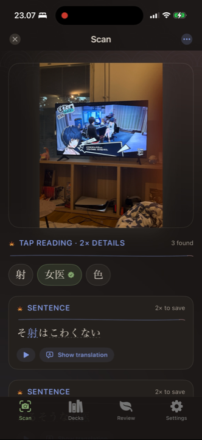<br>
      <sub><b>Scan a TV</b><br>Persona 5 frozen frame · 12 chips · in-deck + known states</sub>
    </td>
    <td align="center" width="25%">
      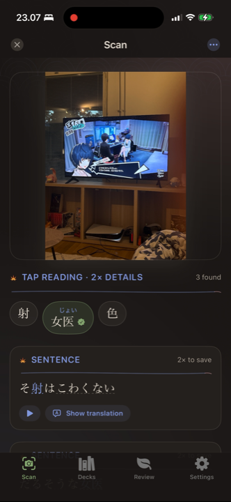<br>
      <sub><b>Decks</b><br>gem-tile avatars + search</sub>
    </td>
    <td align="center" width="25%">
      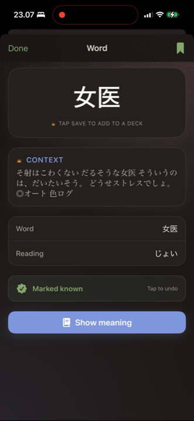<br>
      <sub><b>Deck detail</b><br>mature/learning/new + cram + export</sub>
    </td>
    <td align="center" width="25%">
      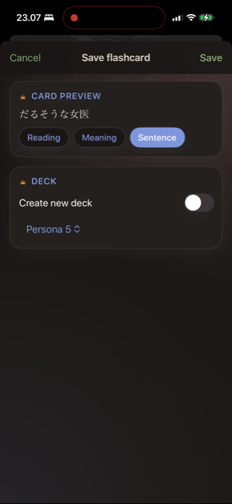<br>
      <sub><b>Review home</b><br>kanji-tile board with due count</sub>
    </td>
  </tr>
  <tr>
    <td align="center" width="25%">
      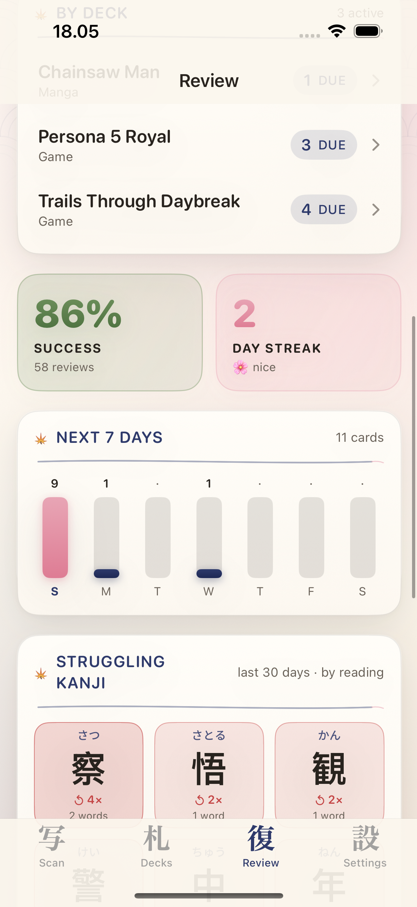<br>
      <sub><b>Stats + 7-day forecast</b><br>gradient stat boxes</sub>
    </td>
    <td align="center" width="25%">
      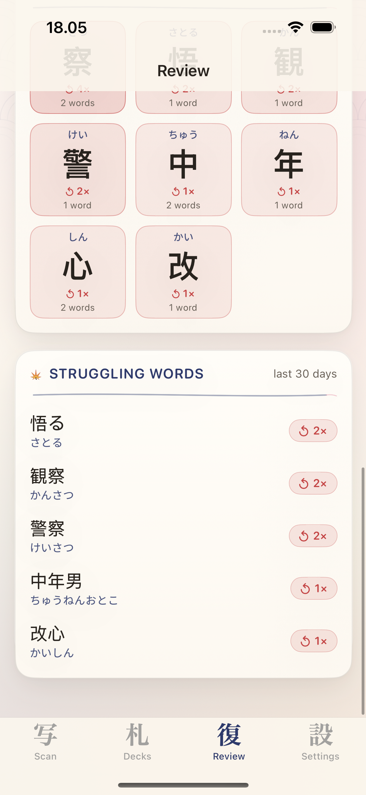<br>
      <sub><b>Struggling kanji</b><br>per-reading tiles, not aggregate</sub>
    </td>
    <td align="center" width="25%">
      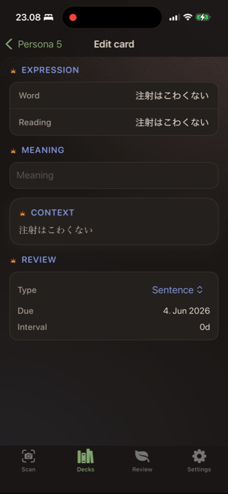<br>
      <sub><b>Settings</b><br>JLPT level + scan filters</sub>
    </td>
    <td align="center" width="25%">
      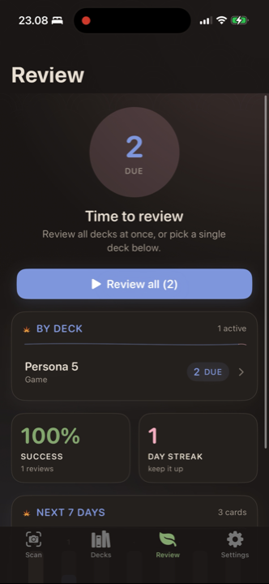<br>
      <sub><b>Achievements</b><br>8-tile catalogue, gold when unlocked</sub>
    </td>
  </tr>
  <tr>
    <td align="center" width="25%">
      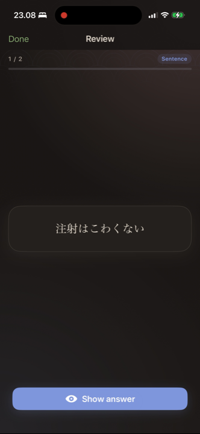<br>
      <sub><b>Flashcard front</b><br>kanji + scanned context, no furigana</sub>
    </td>
    <td align="center" width="25%">
      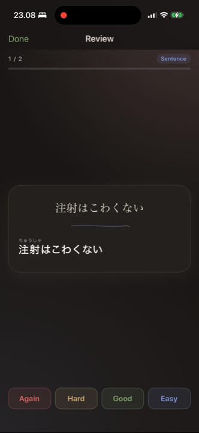<br>
      <sub><b>Flashcard back</b><br>furigana, meaning, audio, Read-aloud, SM-2 grades</sub>
    </td>
    <td align="center" width="25%">
      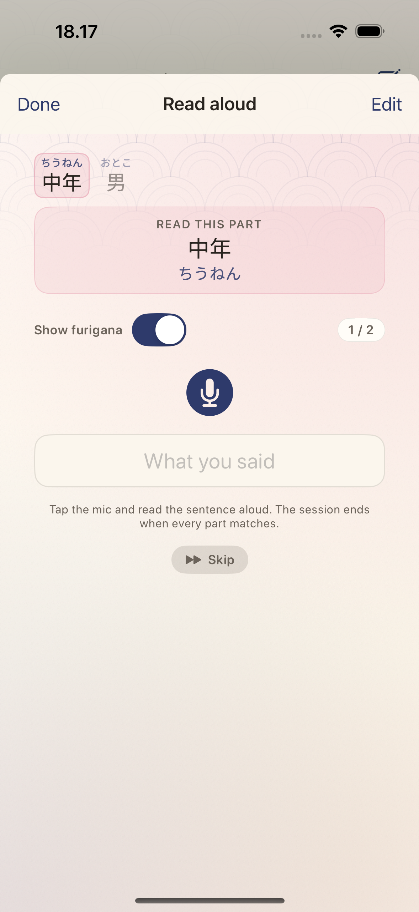<br>
      <sub><b>Read aloud (speech-to-text)</b><br>chunked sentence, mic, auto-advance, skip</sub>
    </td>
    <td align="center" width="25%">
      &nbsp;
    </td>
  </tr>
</table>

### Read-aloud, in detail

Apple's `SFSpeechRecognizer` (Japanese, on-device-preferred, `$0`) backs the **Read aloud** sheet shown above. The flow is built for natural reading speed:

- The sentence auto-splits into chunks by morphological tokenisation. The active chunk pulses sakura; matched chunks tint bamboo, missed vermillion, skipped grey.
- Tap mic **once**. Read the whole sentence at natural speed. As each chunk's expected reading appears in the live transcript, the chunk auto-marks correct and advances. No per-chunk Submit.
- Long pauses keep the session alive — the service auto-restarts the recognition task on silence-finalize without dropping the audio engine.
- **Fuzzy matching** with Levenshtein distance handles the cases where the recogniser mangles boundaries when words run together (e.g. `ストレスでしょ` → `ストレッスでしょ`).
- **JMdict-wide candidate set** — both kana AND kanji forms from JMdict are accepted, so the recogniser writing `判る` instead of `分かる` (same reading, different spelling) still matches.
- **Tap a chunk** to set an endpoint — only chunks up to that point need to be read; the rest grey out and the session auto-completes on hit.
- **Skip** capsule for chunks the recogniser is fighting you on; "I read this" capsule validates the live transcript before advancing (no free passes).
- **Show furigana** toggle inside the sheet flips the prompt between "ruby visible" (easier — practising pronunciation) and "no ruby" (harder — practising recognition).
- Misses + skips surface as **Save-as-flashcard** chips in the summary so the words that gave you trouble become tomorrow's drill.

The same component (`SentenceSpeechCheckView`) is reachable from three places: the Scan tab's captured-sentence card, the front of a sentence flashcard during review (no furigana, the hard mode), and the back of a sentence or word flashcard (with furigana, pronunciation drill).

## Features

### Capture & lookup
- **Freeze-frame camera** + on-device Apple Vision OCR for Japanese.
- **Tap a word chip** for an inline furigana reveal, double-tap for the full word-detail sheet.
- **Offline dictionary** — JMdict + Tanaka Corpus example sentences + Kanjidic2 (on/kun readings, meanings, JLPT) + per-word JLPT vocab list, all bundled in a single SQLite (~50 MB gzipped). Zero network for the main flow.
- **Sentence translation** via Apple's on-device `Translation` framework on captured sentences.

### Flashcards
- **Two card types**: word (kanji + scanned context on front; furigana + meaning + audio + JMdict examples + in-context sentence on back) and sentence (sentence on front; full furigana breakdown + per-token glosses + audio on back).
- **Optional hint** field on the front of any card — small gold lightbulb capsule above the prompt.
- **Per-card tags** with a chip editor in the card edit view, searchable.
- **Cross-deck search** at the top of the Decks tab matches expression / reading / meaning / deck name / tags.
- **Native `.kcdeck` export / import** for sharing decks between Kanji Crush users via the system Share sheet / Files.
- **Anki TSV export** with the importer preamble pre-populated — drop it into Anki → File → Import, no field-mapping needed.
- **Edit a card mid-review** without leaving the SRS session.

### Spaced repetition + drills
- **SM-2 scheduling** (Again / Hard / Good / Easy) with per-deck pause, archive, and cram-study.
- **Typed kanji quiz** — Reading / Meaning / **Speak** modes. Drill a kanji's on'yomi, kun'yomi, and JLPT-tagged example words by typing the answer (hiragana / katakana / romaji all accepted) — wrong answers requeue until they're correct.
- **Read-aloud (speech-to-text grading)** — tap mic once, read a sentence at natural speed. Apple's Japanese `SFSpeechRecognizer` auto-advances chunks as each reading appears in the live transcript. Tap any chunk to set an earlier endpoint. Skip / "I read this" overrides for tricky chunks. Misses surface as save-as-flashcard sheets.
- **Daily challenge** — 5-question typed quiz pulled from your weakest words + struggling kanji. Streak tracked.

### Stats + motivation
- **Per-reading struggling-kanji tiles** — distinguishes 一/いち from 一/ひと so you can target the specific reading you keep missing.
- **Success rate, day streak, 7-day forecast** with gradient stat tiles.
- **8 achievements** ranging from "First card" to "Bookworm" (1000 reviews). Gold when unlocked, dimmed when not.
- **Combo + tile-crush animations** during review — consecutive Good/Easy fires a sakura combo pill; cards graduating learning → mature bloom outward with a particle burst.

### Settings & polish
- **Self-classify by JLPT level** (None / N5–N1). Any word at or below your level auto-marks as known (override per word still works); flashcards for "should-be-known" words show a yellow warning.
- **Japanese UI** — `Localizable.xcstrings` covers ~100 of the most-visible strings; toggle iOS Language to Japanese to see it.
- **Brand identity** — kanji-tile app icon (3×3 match-3 board), custom tab bar (写 / 札 / 復 / 設 — Scan / Decks / Review / Settings), gem-tile gradient surfaces throughout.
- **Accessibility** — VoiceOver labels on chips, stat boxes, struggling-kanji tiles, JLPT chips, achievement tiles.
- **$0 runtime** — fully offline; no ads, no subscriptions, no telemetry, no API keys.

## Requirements

- iPhone with iOS 18+
- Xcode 16+ (full Xcode, not Command Line Tools only)
- Apple Developer account to install on device

## Open in Xcode

```bash
cd kanjicrush
xcodegen generate   # requires: brew install xcodegen
open KanjiCrush.xcodeproj
```

Then select the **KanjiCrush** scheme, your iPhone simulator or device, and Run.

If `xcodegen` is unavailable, create a new **App** project in Xcode named `KanjiCrush`, set deployment target iOS 17, and add all files under `KanjiCrush/` to the target. Add camera usage description:

`NSCameraUsageDescription` = Point your camera at Japanese text on your TV or screen to read words and furigana.

## Project layout

```
KanjiCrush/
├── KanjiCrushApp.swift        @main, ModelContainer, global appearance
├── Features/
│   ├── Scan/                  Camera + OCR + sentence/word chip surface
│   ├── WordDetail/            Word sheet + SaveFlashcardSheet
│   ├── Decks/                 Deck list, deck detail, card edit
│   ├── Review/                Review home + ReviewSessionView (SRS)
│   ├── Kanji/                 KanjiDetailView + KanjiTypedReviewView
│   ├── Settings/              JLPT level, reading filters, appearance
│   └── RootTabView.swift
├── Services/
│   ├── OCRService              Vision text recognition
│   ├── JapaneseAnalysisService CFStringTokenizer + Latin→Hiragana
│   ├── DictionaryService       Offline JMdict + Tanaka + Kanjidic2 (SQLite)
│   ├── SRSService              SM-2 scheduling
│   ├── StatsService            Forecast, streak, struggling kanji-by-reading
│   ├── Knownness               Combines KnownWord + JLPT-implied known
│   ├── SpeechService           AVSpeechSynthesizer wrapper
│   ├── ReadingOverrideStore    User-editable per-word reading overrides
│   └── MockDataSeeder          Dev mode: -seedMockData reset|append
├── Models/                     SwiftData @Model: Deck, Flashcard, ReviewLog, KnownWord
├── Theme/Theme.swift           Palette + WashiBackground + GemTile primitives
├── Utilities/FuriganaText.swift CTRubyAnnotation-backed views
└── Resources/
    ├── Assets.xcassets         AppIcon, color sets
    ├── jmdict.sqlite.gz        Bundled offline dictionary (~50 MB)
    └── reading_overrides.json
tools/
├── build_jmdict.py             Builds jmdict.sqlite.gz from source data
└── generate_icon.swift         Renders AppIcon-1024.png via SwiftUI ImageRenderer
```

## Data sources

- **OCR**: Apple Vision (`VNRecognizeTextRequest`)
- **Tokenization & readings**: `CFStringTokenizer` with `kCFStringTokenizerAttributeLatinTranscription`, then `CFStringTransform(kCFStringTransformLatinHiragana)`
- **Dictionary, examples, JLPT, kanji metadata** — all baked into the bundled `jmdict.sqlite.gz`. Built locally via `tools/build_jmdict.py` from:
    - [JMdict-simplified](https://github.com/scriptin/jmdict-simplified) (`jmdict-eng-*.json`) — words + glosses
    - [Tanaka Corpus](https://ftp.edrdg.org/pub/Nihongo/examples.utf.gz) — example sentences
    - [davidluzgouveia/kanji-data](https://github.com/davidluzgouveia/kanji-data) — Kanjidic2 JSON for per-kanji on/kun readings, meanings, JLPT levels
    - [jamsinclair/open-anki-jlpt-decks](https://github.com/jamsinclair/open-anki-jlpt-decks) — JLPT N5–N1 word lists
- **Translation**: Apple `Translation` framework (on-device)
- **Text-to-speech**: `AVSpeechSynthesizer` (`ja-JP`)

## Rebuilding the bundled dictionary

```bash
python3 tools/build_jmdict.py \
  /path/to/jmdict-eng.json \
  KanjiCrush/Resources/jmdict.sqlite \
  --examples /path/to/examples.utf \
  --kanjidic /path/to/kanji.json \
  --jlpt /path/to/jlpt-words.json
gzip -9 -f KanjiCrush/Resources/jmdict.sqlite
```

The `DictionaryService` keys cache invalidation off the gzip file size, so a fresh build automatically re-unpacks on next launch.

## License

Personal project. JMdict, Kanjidic2, Tanaka Corpus, and the JLPT word lists are subject to their respective licenses; see each source repo for terms.
